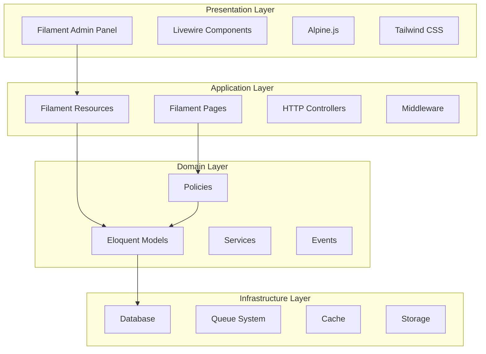
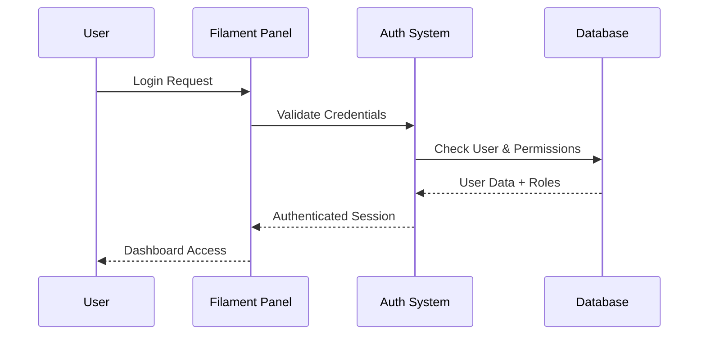

# Architecture Guide

This guide explains the architectural decisions, patterns, and design principles used in this Filament v4 Laravel 12 starter project.

## 📋 Table of Contents

- [System Overview](#system-overview)
- [Laravel 12 Architecture](#laravel-12-architecture)
- [Filament v4 Integration](#filament-v4-integration)
- [Database Design](#database-design)
- [Security Architecture](#security-architecture)
- [Performance Considerations](#performance-considerations)
- [Design Patterns](#design-patterns)

## System Overview

### Architecture Philosophy

This project follows a **Server-Driven UI (SDUI)** architecture powered by Filament, built on Laravel's robust foundation. The architecture emphasizes:

- **Separation of Concerns**: Clear boundaries between layers
- **Convention over Configuration**: Laravel and Filament conventions
- **Progressive Enhancement**: Build features incrementally
- **Security by Default**: Built-in security patterns

### High-Level Architecture



## Laravel 12 Architecture

### Streamlined File Structure

Laravel 12 introduces a simplified directory structure that this project adopts:

```
app/
├── Console/Commands/      # Custom Artisan commands
├── Filament/             # Filament-specific components
├── Http/Controllers/     # HTTP controllers (minimal usage)
├── Models/               # Eloquent models
├── Policies/             # Authorization policies
└── Providers/            # Service providers

bootstrap/
├── app.php              # Application configuration
└── providers.php        # Service provider registration

config/                  # Configuration files
database/               
├── factories/           # Model factories
├── migrations/          # Database migrations
└── seeders/            # Database seeders

routes/
├── console.php          # Console routes/commands
└── web.php             # Web routes
```

### Key Laravel 12 Changes

1. **No Kernel Classes**: Configuration moved to `bootstrap/app.php`
2. **Automatic Command Registration**: Commands in `app/Console/Commands/` auto-register
3. **Simplified Middleware**: Registered in `bootstrap/app.php`
4. **Streamlined Structure**: Fewer directories, clearer organization

### Bootstrap Configuration

```php
// bootstrap/app.php
return Application::configure(basePath: dirname(__DIR__))
    ->withRouting(
        web: __DIR__.'/../routes/web.php',
        commands: __DIR__.'/../routes/console.php',
        health: '/up',
    )
    ->withMiddleware(function (Middleware $middleware): void {
        // Middleware registration
    })
    ->withExceptions(function (Exceptions $exceptions): void {
        // Exception handling
    })->create();
```

## Filament v4 Integration

### Resource Architecture

Filament v4 introduces a more modular approach to resources with separated concerns:

```
app/Filament/Resources/Pengaturan/Users/
├── UserResource.php          # Main resource definition
├── Pages/                    # Resource pages
│   ├── CreateUser.php
│   ├── EditUser.php
│   └── ListUsers.php
├── Schemas/                  # Form schemas
│   └── UserForm.php
└── Tables/                   # Table configurations
    └── UsersTable.php
```

### Component Organization

```php
class UserResource extends Resource
{
    protected static ?string $model = User::class;
    
    public static function form(Schema $schema): Schema
    {
        return UserForm::configure($schema);
    }
    
    public static function table(Table $table): Table
    {
        return UsersTable::configure($table);
    }
}
```

### Key Filament v4 Features

1. **Schema-Based Forms**: Declarative form definitions
2. **Modular Resources**: Separated concerns for better maintainability
3. **Enhanced Tables**: Improved filtering and actions
4. **Icon System**: Heroicon enum integration
5. **Improved Performance**: Better caching and optimization

## Database Design

### Model Architecture

#### ULID Integration

All models use ULIDs (Universally Unique Lexicographically Sortable Identifiers) for better performance and security:

```php
// app/Concerns/HasUlids.php
trait HasUlids
{
    protected function usesUniqueIds(): bool
    {
        return true;
    }
    
    public function newUniqueId(): string
    {
        return (string) Str::ulid();
    }
}
```

#### Model Relationships

```php
// User Model
class User extends Authenticatable
{
    use HasUlids, SoftDeletes;
    
    // Relationships
    public function roles(): BelongsToMany
    {
        return $this->belongsToMany(Role::class);
    }
}
```

### Migration Strategy

#### Database Schema

```sql
-- Users table with ULID primary key
CREATE TABLE users (
    id CHAR(26) PRIMARY KEY,
    name VARCHAR(255) NOT NULL,
    email VARCHAR(255) UNIQUE NOT NULL,
    email_verified_at TIMESTAMP NULL,
    password VARCHAR(255) NOT NULL,
    created_at TIMESTAMP NULL,
    updated_at TIMESTAMP NULL,
    deleted_at TIMESTAMP NULL
);

-- Permission system tables (Spatie Permission)
CREATE TABLE roles (
    id CHAR(26) PRIMARY KEY,
    name VARCHAR(255) NOT NULL,
    guard_name VARCHAR(255) NOT NULL,
    created_at TIMESTAMP NULL,
    updated_at TIMESTAMP NULL
);
```

## Security Architecture

### Authentication Flow



### Authorization Layers

1. **Panel-Level**: Filament panel access control
2. **Resource-Level**: Resource visibility and access
3. **Action-Level**: Individual action permissions
4. **Field-Level**: Form field visibility

### Permission Management

Using Filament Shield for comprehensive permission management:

```php
// Generated by Filament Shield
class UserPolicy
{
    public function viewAny(User $user): bool
    {
        return $user->can('view_any_pengaturan::users::user');
    }
    
    public function create(User $user): bool
    {
        return $user->can('create_pengaturan::users::user');
    }
}
```

## Performance Considerations

### Optimization Strategies

#### 1. ULID Benefits
- **Better Performance**: Naturally ordered for better database performance
- **Security**: Non-sequential, harder to guess
- **Compatibility**: Works with existing systems

#### 2. Eager Loading
```php
// Prevent N+1 queries
User::with(['roles', 'permissions'])->get();
```

#### 3. Caching Strategy
- **Query Caching**: Cache expensive database queries
- **View Caching**: Cache compiled Blade templates
- **Route Caching**: Cache route definitions

#### 4. Database Optimization
- **Indexes**: Strategic index placement
- **Soft Deletes**: Keep data integrity while improving performance
- **Connection Pooling**: Efficient database connections

### Monitoring and Profiling

- **Laravel Telescope**: Request/query monitoring
- **Laravel Pail**: Real-time log monitoring
- **Built-in Profiling**: Query time analysis

## Design Patterns

### Repository Pattern (Optional)

While Laravel's Eloquent is sufficient for most cases, complex business logic can benefit from repositories:

```php
interface UserRepositoryInterface
{
    public function findActiveUsers(): Collection;
    public function createWithRoles(array $userData, array $roles): User;
}

class UserRepository implements UserRepositoryInterface
{
    public function findActiveUsers(): Collection
    {
        return User::whereNull('deleted_at')
                   ->with('roles')
                   ->get();
    }
}
```

### Service Layer Pattern

For complex business operations:

```php
class UserManagementService
{
    public function createUserWithPermissions(
        array $userData, 
        array $roleIds
    ): User {
        DB::transaction(function () use ($userData, $roleIds) {
            $user = User::create($userData);
            $user->roles()->attach($roleIds);
            
            // Send welcome email, log activity, etc.
            
            return $user;
        });
    }
}
```

### Command Pattern

For complex operations and background processing:

```php
class ProcessUserRegistration implements ShouldQueue
{
    public function handle(): void
    {
        // Complex user setup logic
        // Email verification, role assignment, etc.
    }
}
```

## Integration Patterns

### Filament Integration

#### Custom Pages
```php
class Dashboard extends Page
{
    protected static ?string $navigationIcon = 'heroicon-o-home';
    
    protected function getHeaderWidgets(): array
    {
        return [
            // Custom widgets
        ];
    }
}
```

#### Custom Resources
```php
class UserResource extends Resource
{
    public static function getNavigationBadge(): ?string
    {
        return static::getModel()::count();
    }
    
    public static function getNavigationBadgeColor(): string|array|null
    {
        return static::getModel()::count() > 10 ? 'warning' : 'primary';
    }
}
```

### Laravel Integration

#### Service Providers
```php
class AppServiceProvider extends ServiceProvider
{
    public function boot(): void
    {
        // Global application configuration
        Model::preventLazyLoading(! $this->app->isProduction());
    }
}
```

## Testing Architecture

### Testing Strategy

1. **Feature Tests**: End-to-end user workflows
2. **Unit Tests**: Individual component testing
3. **Filament Tests**: Admin panel interaction testing

### Example Test Structure

```php
class UserManagementTest extends TestCase
{
    use RefreshDatabase;
    
    public function test_admin_can_create_user(): void
    {
        $admin = User::factory()->create();
        $admin->assignRole('super_admin');
        
        $this->actingAs($admin);
        
        livewire(CreateUser::class)
            ->fillForm([
                'name' => 'Test User',
                'email' => 'test@example.com',
            ])
            ->call('create')
            ->assertNotified();
            
        $this->assertDatabaseHas('users', [
            'email' => 'test@example.com'
        ]);
    }
}
```

## Deployment Architecture

### Production Considerations

1. **Environment Configuration**: Proper `.env` setup
2. **Database Optimization**: Production database settings
3. **Caching Strategy**: Redis/Memcached setup
4. **Queue Processing**: Background job handling
5. **Monitoring**: Application performance monitoring

### Scaling Considerations

- **Database**: Read replicas, connection pooling
- **Cache**: Distributed caching with Redis
- **Queue**: Multiple queue workers
- **CDN**: Static asset delivery
- **Load Balancing**: Multiple application servers

---

## Related Documentation

- [API Reference](API.md) - Detailed component reference
- [Development Guide](DEVELOPMENT.md) - Development workflow
- [Deployment Guide](DEPLOYMENT.md) - Production deployment